# Input Query Language (IQL)

Input Query Language (IQL) is a query language that accepts a string and creates constrainable dialogs. IQL grammar is used to generate various types of dialogs in relatively few lines of code. Each dialog contains components that validate the user input according to the provided set of constraints.

Here is a list of the components and the dialogs that IQL support. For more details about IQL components, dialogs, constraints and how to use please read the [guide](guides/guide.pdf).

## Components
 - [String](#string)
 - [Integer](#integer)
 - [Decimal](#decimal)
 - [Boolean](#boolean)
 - [TextArea](#textArea)
 - [Password](#password)
 - [Slider](#slider)
 - [SingleOpt](#singleOpt)
 - [MultiOpt](#multiOpt)
 - [Group](#group)
 - [Tab](#tab)
 
 ### String
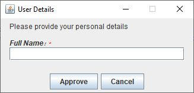
```
'User Details' Single(
  'Please provide your personal details')
name 'Full Name:' String
```

 ### Integer
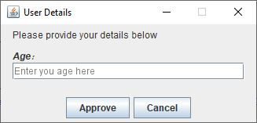
```
'User Details' Single(
  'Please provide your personal details')
age 'Age:' Integer{
  placeholder='Enter you age here'
  optional
  }
```
 ### Decimal
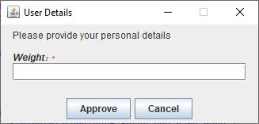
```
'User Details' Single(
  'Please provide your personal details')
weight 'Weight:' Decimal
```

 ### Boolean
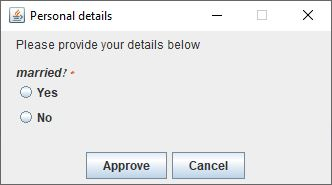
```
'Personal details' Single(
  'Please provide your details below')
married 'Married?' Boolean
```

 ### TextArea

```
'User Details' Single(
  'Please provide your personal details')
comment 'Comment:' TextArea('My name is...')
```

 ### Password
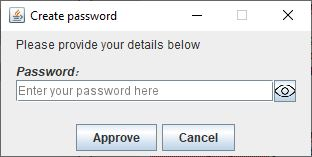
```
'Create password' Single(
  'Please provide your details below')
password 'Password:' Password
  placeholder='Enter your password here'
```

 ### Slider
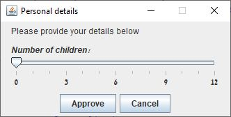
```
'Personal details' Single(
  'Please provide your details below')
children 'Number of children:' Slider['0,12']{
  majorTicks=3
  minorTicks=1
  }
```

 ### SingleOpt
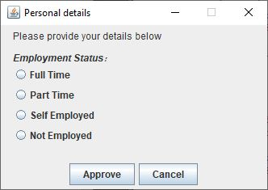
```
'Personal details' Single(
  'Please provide your details below')
employment 'Employment Status:' 
  SingleOpt['Full Time|Part Time|Self Employed|Not Employed']
	{optional}
```

 ### MultiOpt
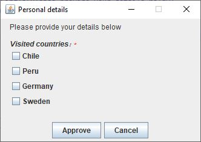
```
'Personal details' Single(
  'Please provide your details below')
countries 'Visited countries:' MultiOpt['Chile|Peru|Germany|Sweden']
```

 ### Group
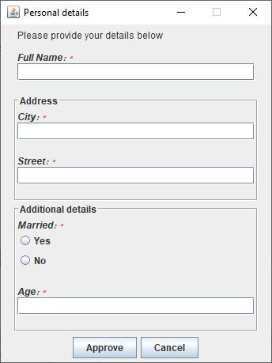
```
'Personal details' Single(
  'Please provide your details below')
name 'Full Name:' String
'Address' Group{
	city 'City:' String
	street 'Street:' String
	}
'Additional details' Group{
	married 'Married:' Boolean
	age 'Age:' Integer
	}
```

 ### Tab
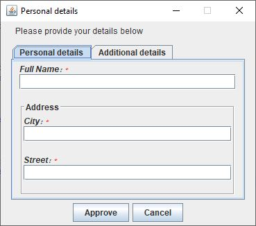
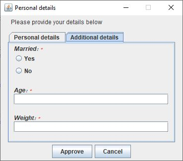
```
'Personal details' Single('Please provide your details below')
'Personal details' Tab{
  name 'Full Name:' String
  'Address' Group{
	  city 'City:' String
	  street 'Street:' String
	  }
  }
'Additional details' Tab{
  married 'Married:' Boolean
  age 'Age:' Integer
  weight 'Weight:' Decimal
  }
```

## Dialogs
 - [Single](#single)
 - [Pages](#pages)
 - [Tabular](#tabular)

### Single
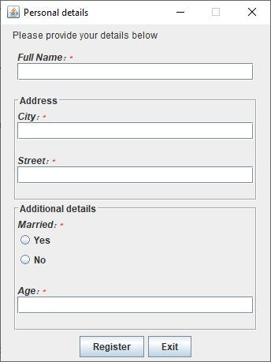
```
'Personal details' Single(
  'Please provide your details below'){
    approve='Register'
    cancel='Exit'
	}
name 'Full Name:' String
'Address' Group{
	city 'City:' String
	street 'Street:' String
	}
'Additional details' Group{
	married 'Married:' Boolean
	age 'Age:' Integer
	}
```

### Pages
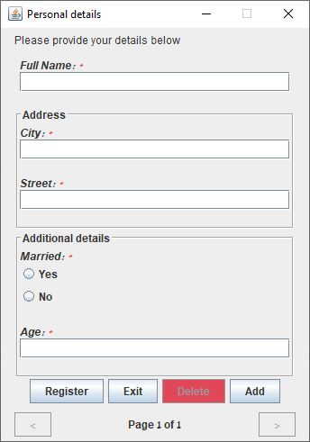
```
'Personal details' Pages(
  'Please provide your details below'){
    min=2
    max=8
    approve='Register'
    cancel='Exit'
	}
name 'Full Name:' String
'Address' Group{
	city 'City:' String
	street 'Street:' String
	}
'Additional details' Group{
	married 'Married:' Boolean
	age 'Age:' Integer
	}
```
### Tabular
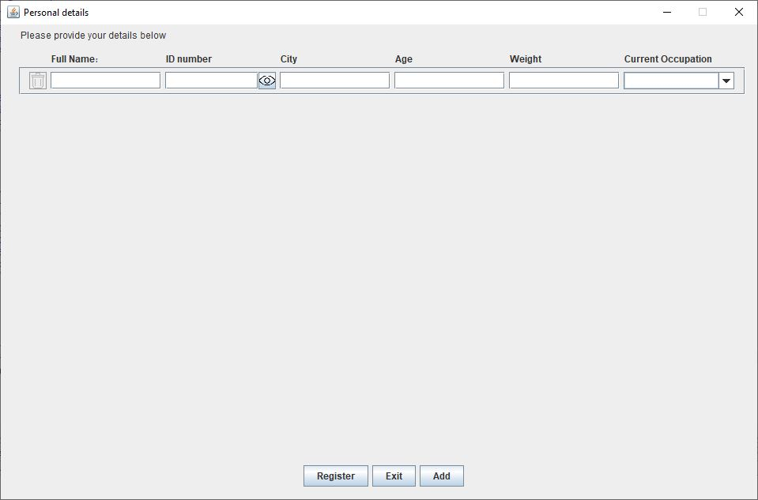
```
'Personal details' Tabular(
  'Please provide your details below'){
    min=2
    max=30
    approve='Register'
    cancel='Exit'
    }
name 'Full Name' String{optional}
id 'ID number' Password{optional}
city 'City' String{optional}
age 'Age' Integer{optional}
weight 'Weight' Decimal{optional} 
occupation 'Current Occupation' SingleOpt[
  'Builder|Farmer|Baker|No occupation']
  {optional}
```

## Examples

### Java
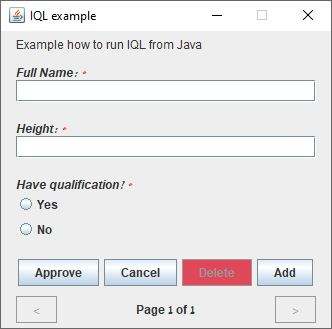
```
import iql.IQL;

public class IqlJavaExample {
  public static void main(String[] args) {
    String query = """
      'IQL example' Pages('Example how to run IQL from Java')
      name 'Full Name:' String
      height 'Height:' Integer
      qualification 'Have qualification?' Boolean
      """;
    List<Map<String, String>> result = IQL.run(query);
    }
}
```

### [L42](https://github.com/ElvisResearchGroup/L42)
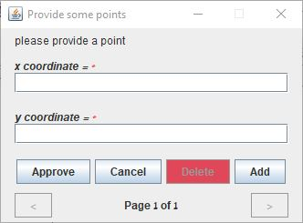
```
reuse [AdamTowel]
Point=Data:{Num x, Num y}
Points=Collection.list(Point)

LoadJ=Load:{reuse[JavaServer]}
J=LoadJ(slaveName=S"iqlServer{}")
LoadQuery=Load:{reuse[Query]}

IQL=LoadQuery.iql(javaServer=J)
MyQ=IQL.query[Points;S]"""
  |'Provide some points'
  |      Pages(@msg)
  |x 'x coordinate =' Integer
  |y 'y coordinate =' Integer
  """
MainL=(
  iql=IQL.#$\mbox{\textdollar}$of()
  ps=MyQ(iql)(msg=S"please provide a point")
  )
```
